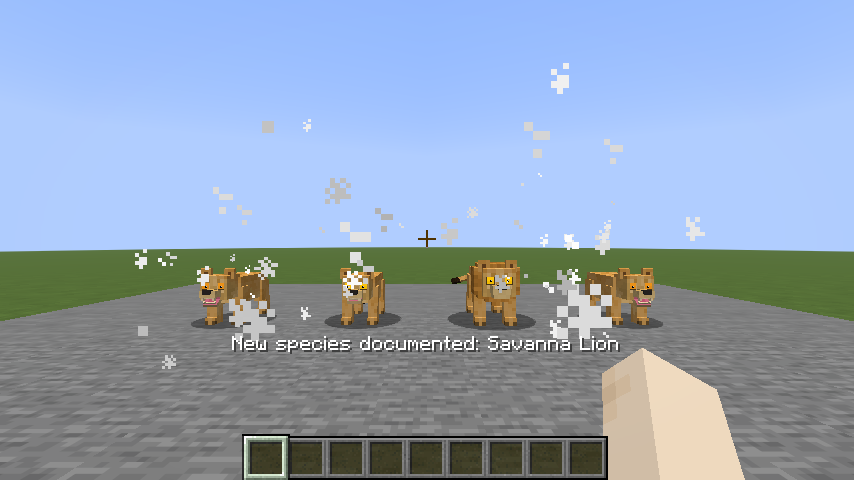
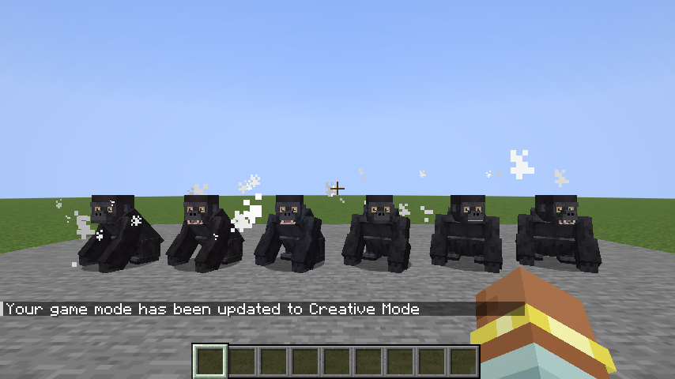
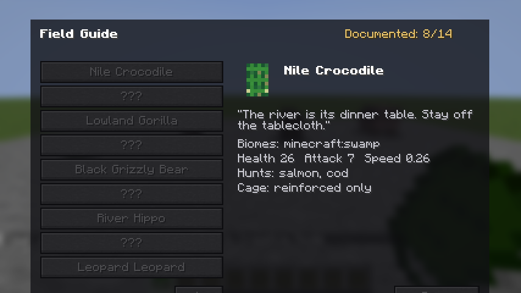

# Menagerie

A wildlife mod for Fabric (Minecraft 26.2) in the spirit of Untamed Wilds and Alex's
Mobs: a flagship gorilla with real troop life plus a growing roster, all built on a
**data-driven species registry** — adding a new species of an existing animal is one
JSON file, zero Java.

## The interaction layer (Phase 3, v0.3.0)

- **Cage Traps** — craft a cage (8 iron bars + chest) or a **Reinforced Cage** (8
  iron blocks + cage), bait it with the animal's favorite food (tame/breed/diet
  item), and a calm wild animal walks itself in. Break the closed cage and carry
  the animal as an item (tooltip names the occupant); place and right-click to
  release with species, health, name and tame state intact. Big animals (gorilla,
  crocodile, hippo, grizzly — `cage_tier: 2`) shred standard cages after 3 seconds.
  Aggroed animals can't be caged; tamed pets can be led in for transport.
- **Field Guide** — book + melon slice. Species entries unlock by getting within 8
  blocks of a living specimen (ping + action-bar note); undiscovered entries are
  silhouettes. Every entry is generated live from the species registry — biomes,
  stats, taming, diet, territory, venom, cage tier, plus an optional `guide_blurb`
  line — so datapack species appear automatically. Completion counter included.
- **Gorilla forage ecology** — troops raid melons and berry bushes (mobGriefing);
  a troop fed in the last 5 minutes is *content*: taming chance doubles (2/3),
  chest-beats calm down, and they lounge instead of roaming. Feeding by hand
  counts. Driven by a generic optional `forage` JSON block any animal can adopt.
- **Warfront crossover (optional)** — with Warfront installed, soldiers softly
  avoid live hippo territories and gorilla troop grounds, and combat inside those
  zones turns the animals on the combatants. Implemented with zero hard dependency
  (entity-id matching only); `MenagerieTerritories` is a public API + event other
  mods can use. Menagerie runs identically without Warfront.

## Roster (Phase 2, v0.2.0)

- **Hippo** — rivers/swamps; claims a water-anchored **territory** (radius in JSON).
  Passive outside it; intruders get a 3-second yawn warning, then a 60-HP charge.
  Destroys boats in two bites (planks and sticks float where your ride was). Calms
  ~20s after you leave. Species: `river`, `swamp` (darker, smaller).
- **Grizzly Bear** — taiga/forests; neutral with **mother-aggro** (hurt a cub, or
  crowd within 6 blocks of one, and every adult within 16 comes). Fishes salmon out
  of rivers with paw-swipes when hungry (**diet** block), raids berry bushes
  (mobGriefing), sleeps at night in shelter — day is the threat window. Species:
  `grizzly`, `black` (smaller, flees players unless cubs are near).
- **Vulture** — deserts/badlands/savannas; circles 20-30 blocks up. Any mob death
  nearby that leaves meat pulls every vulture within 48 blocks: they converge,
  circle ~10s, land, and strip the drops — a "something died here" beacon you can
  read from across the biome. Only ever pecks players below 3 hearts. Never spawns
  indoors; drifts away and despawns if never interacted with.
- **Snake** — coiled and near-invisible until you're 4 blocks away (rattle warning),
  strikes only inside 2 — careful players are never bitten. Species: `viper`
  (desert/badlands, **venom** block: Poison II 8s), `python` (jungle, brief
  constricting grab — the crocodile's grab code, shared). Worldgen-only ambience,
  no drops.

## Roster (Phase 1, v0.1.0)

- **Gorilla** — jungle troops of 3–6 with exactly one **silverback** (bigger, +50%
  attack, silver saddle). Neutral until you hurt any troop member — then the whole
  troop retaliates. The silverback chest-beats on a 30–90s cadence and when hostile
  mobs close in (slows nearby monsters, never players). Tame with **melon slices**
  (1-in-3 per feed) into a wolf-style companion: sit, follow, teleports past 32
  blocks, defends you. Babies ride on adults' backs until grown. Idle adults
  occasionally tear a leaves block (needs `mobGriefing`). Species: `lowland`
  (jungle), `mountain` (bamboo and montane jungle, thicker coat, +4 health).
- **Crocodile** — swamp ambush predator: floats in water, lunges at prey in reach,
  drags it (slowness + damage over 2s), releases. Neutral on land. Species: `nile`
  (swamp), `saltwater` (mangrove, 20% bigger, harder-hitting).
- **Tortoise** — savanna/badlands, fully passive, `worldgen_only`: spawns only with
  newly generated chunks, never respawns, drops nothing — killing them permanently
  empties the area. When hit it tucks into its shell: +8 armor, immobile, 10s.
  Breeds with sweet berries.
- **Leopard** — jungle stalker: crouch-approaches chickens, rabbits and baby animals,
  pounces with a leap; only attacks players already below half health; backs off when
  two or more players are close. Species: `leopard` (jungle), `snow` (grove/peaks,
  white coat, +4 health).

## The species system

Every tunable lives in `data/menagerie/species/*.json`: biomes (tags preferred),
spawn weight, group size, `worldgen_only`, health/attack/speed/scale, tame & breed
items, texture, and a per-animal `special` block (chest-beat cadence, grab length,
shell armor…). Species are hot-reloaded (`/reload`) and datapack-extensible.

Debug commands (`/menagerie census|troops|silverback`) print species/troop state —
built for the headless test battery in `VERIFY.md`.

## Known limitations

- Spawn **weights** are baked into biomes at world load: `/reload` can lower a
  species' effective natural-spawn rate (weight 0 = stop respawns) but raising a
  weight needs a server restart. Everything else (stats, items, special knobs) is
  fully live.
- The vulture is the last hand-made animal — no public-domain source has been found for
  it, so its art is unchanged.
- No spawn eggs yet; use `/summon` (plain summon picks the biome-correct species).
- No loot tables yet — the roster drops nothing by design in Phase 1.
- `/summon` with extra NBT skips species finalization (vanilla behavior); plain
  `/summon` does the right thing.

## Art & sound

Vanilla-derived by doctrine: every texture is painted by `tools/gen-textures.js` onto
our own cube-model UV layouts using palettes **sampled from vanilla mob textures**
(wolf/panda grays, turtle greens, ocelot golds, polar bear whites) — no pixels copied
from other mods. All sounds are pitch-shifted references to vanilla sound events via
`sounds.json`; no external audio. License research for the referenced mods is in
`RESEARCH.md` (Alex's Mobs and Untamed Wilds were studied as *patterns only*).

## Building

JDK 25. `./gradlew build` → `build/libs/menagerie-<version>.jar`. Dev client:
`./gradlew runClient`. Render regression test: `./gradlew runGametest` (screenshots in
`build/run-gametest/screenshots/`).

## Changelog

### 0.4.7 — Creative access (2026-08-16)

- **Spawn eggs for all nine animals** — gorilla, crocodile, tortoise, leopard, hippo,
  grizzly, vulture, lion, snake. None existed before; every animal needed a command to
  obtain.
- **A dedicated "Menagerie" creative tab** holding everything the mod adds: the Field
  Guide, both cage traps, and all nine eggs.
- Egg icons are vanilla's own spawn egg recoloured (26.2 removed the tintable template,
  so each egg must ship its own texture), with colours **sampled from each animal's body
  texture** so an egg matches what it produces. Provenance in
  [`ASSETS-ORIGIN.md`](ASSETS-ORIGIN.md).
- **New build gate:** a registered entity with no spawn egg now fails the build, as does
  a registered item with no lang key or a tab with no title. The item list is read from
  the shipped item definitions rather than scraped out of Java — the old regex both
  missed concatenated names and mistook the tab id for an item.
- The render battery opens the tab, asserts every registered item is listed, and then
  spawns each animal from its egg to confirm the right species and no placeholder skin.

### 0.4.6 — Size pass (2026-08-16)

Every animal resized against **measured** vanilla hitboxes (cow 0.90x1.40, horse
1.40x1.60, polar bear 1.40x1.40, ravager 1.95x2.20, wolf 0.60x0.85, turtle 1.20x0.40,
ocelot 0.60x0.70, chicken 0.40x0.70) rather than by eye.

- **Hitboxes never matched their models.** Measuring the baked meshes showed the hippo
  was a 1.06-block-tall model inside a 1.60-block box — a third of it empty air you
  could swing at and hit. The gorilla had the reverse fault, a mesh *larger* than its
  hitbox, so you could walk into its visible body. Entity dimensions now match the
  measured mesh, and `size_scale` multiplies model and hitbox together from there.
- The hippo is now genuinely imposing: **2.27 x 1.85**, ravager-class bulk and lower —
  2.5x a cow's width, and finally taller than the player.
- Gorilla 1.35 x 1.70 (polar-bear height, narrower), grizzly 1.44 x 1.44 (at the polar
  bear), lion 1.84 x 1.27, leopard 1.25 x 1.00 (between ocelot and bear), crocodile
  2.00 x 0.40 (long and low), tortoise 1.11 x 0.98, vulture 0.89 x 0.85, snake
  0.99 x 0.33.
- **New mesh-fill validator** in the render battery: every model must fill 80-125% of
  its hitbox height, or the build fails. The snake is the one documented exemption —
  its mesh is 0.13 thin, and 0.30 is the floor for an entity that still has to be
  clickable and pathfind.
- Babies stay proportional (adult scale x vanilla baby transform), and every species is
  photographed beside its vanilla anchor in `build/run-gametest/screenshots/`.

### 0.4.5 — Density restored (2026-08-16)

Texture fix confirmed in-world; this pairs it with the spawn-density correction.

- **Gorilla habitat restored.** 0.4.4 cut mountain gorillas to bamboo jungle plus two
  Terralith montane jungles, roughly halving gorilla habitat for the sake of a tidy
  "jungle-family" reading — and players stopped finding them. `#minecraft:is_hill` is
  back (3 → 6 vanilla biomes). `minecraft:grove` stays out: a snowy conifer forest was
  the one genuinely wrong entry.
- **Rarity ladder scaled 2.5x** — ubiquitous 12→30, common 8→20, uncommon 4→10,
  rare 2→5, epic 1→2. The 0.4.0 cut was right about runaway accumulation but overshot
  discoverability. `nearby_cap` is untouched and still bounds local density, so this
  changes how often you *meet* an animal, not how much a biome silts up.
- Scaling the **whole** ladder matters: bumping only the two tiers in use left
  `uncommon` (10) above `common` (8). `spawn-lint` now enforces monotonicity (S10).
- **New habitat census in the render battery**: counts how many *baked* biomes actually
  carry a spawn entry per animal, and fails if any animal reaches zero. Everything
  upstream of it — species JSON, tag resolution, registry load — is a statement of
  intent; this measures the only thing that decides whether a player ever meets an
  animal.
- The roll-range table now prints on **every build**, not just on request.

### 0.4.4 — Every lion coat actually renders (2026-08-16)

- **13 of the lion's 15 declared coats were unreachable.** `lion_savanna` declares 8
  and `lion_barbary` 7, but the per-individual fur pick lived only in the gorilla's
  entity class, so every lion rendered its species' base skin. The pick now lives in
  the shared species resolver, so any species with a `textures` list gets it with zero
  Java. Lions visibly vary within a pride now.
- Asset-path validation could never catch this — every declared texture existed and
  shipped. Two new guards do: the build asserts the shared resolver still reads the fur
  table and that no entity subclass overrides it without delegating, and the render
  battery force-spawns **every** skin index (searching for a UUID that lands on each,
  rather than sampling) and proves none renders the placeholder. 34/34 skins.
- `tools/asset-audit.py --skin-matrix` prints the per-species roll-range table: skins
  the renderer can select vs textures shipped, plus any file no species can ever roll.

### 0.4.3 — Audit sweep 2 (2026-08-16)

Follow-up sweep over 0.4.2's own verification. No new defect in shipped behavior; four
gaps in what was being *checked*.

- **The fallback texture is now proven to load on the client.** Every render test
  resolved a real skin, so the placeholder itself had never been exercised — the claim
  that a Menagerie fallback can never be a checkerboard rested on an untested file. It
  is now asserted present, decodable, and magenta/amber.
- **Diagnosing a checkerboard from a screenshot.** Magenta + black is *vanilla's*
  missing texture, so that client is running pre-0.4.2 code. Magenta + amber is ours,
  meaning the server did not sync a skin — usually a server older than the client.
  `texture()` now logs a one-shot warning naming that cause.
- **Three more slices of the requestable set are gated:** vanilla sound event ids,
  vanilla item/block/entity/effect ids named by species data and recipes (the shape of
  the 0.4.1 missing-bait bug), and lang keys for every registered entity, item and
  block.
- The `aquatic` species field was read by nothing in Java. The waterline spawn placement
  now consults it directly, so water counts as ground only for a species whose data says
  so.

### 0.4.2 — Reliability audit + full sweep (2026-08-16)

Two bugs were reported from the live server; the response was a sweep of every species,
every asset path and every spawn rule, plus build-time gates so the whole class cannot
come back. Full findings in [`AUDIT.md`](AUDIT.md).

- **Animals no longer render as missing-texture checkerboards on a dedicated server.**
  Species definitions are a datapack, so a *remote* client's registry is empty and every
  animal fell through to a fallback texture path that vanilla renamed. Skins are now
  resolved on the server and synced to the client, which never needs the registry to
  draw an animal, and both fallbacks point at a texture this mod actually ships.
- **Hippos and crocodiles spawn at the water line, not the sea floor.** Their placement
  performed no depth test, so any submerged position in a river column was valid. They
  now require open air close above and a floor close below.
- **Babies are vanilla-sized.** `baby_scale` was multiplying the SCALE attribute on top
  of the already-halved baby model, rendering calves at about a quarter of adult size
  and over-shrinking their hitboxes. It now defaults to 1.0 = vanilla proportions.
- **Every species is visible to Terralith.** Seven used raw biome ids that match no
  Terralith biome; they now key off tags Terralith extends. Per-species resolved
  coverage is in [`docs/biome-coverage.md`](docs/biome-coverage.md).
- **Ecology fixes:** gorillas moved from windswept hills and a snowy grove to montane
  jungle; snow leopards excluded from Terralith's volcanic peaks and tropical jungle;
  hippos and crocodiles excluded from frozen rivers and ice marsh; reptiles excluded
  from snowy badlands.
- **Two new build gates.** `assetAudit` proves every asset path the mod can request
  exists in the shipping jar; `spawnLint` proves every species' spawn rules stay inside
  its ecology. Both fail `./gradlew build` and both assert their own anchors so they
  cannot silently pass by matching nothing.
- **Cage releases are transactional.** A captured animal's NBT is cleared only after
  its full entity/passenger tree successfully returns to the world. Invalid or
  incompatible data leaves the cage closed and recoverable instead of silently
  deleting the occupant; wrong-tier breakouts have the same protection.
- **Live JSON stat tuning now reaches existing animals.** A successful `/reload`
  reapplies health, speed, attack, scale, and knockback while preserving each animal's
  health percentage. Adding forage or breeding data can also attach its goal to animals
  already in the world.
- Migrated deprecated chunk, block-entity-data, and renderer calls to the Minecraft
  26.2 APIs, fixed the vulture movement controller's raw type, and enabled permanent
  deprecation/unchecked compiler lint.
- Updated the mod metadata, which still described only the four-animal Phase 1 roster.

### 0.4.1 — Post-release audit (2026-08-16)

No new content. 0.4.0 was audited after shipping and every item here was a defect in the
released jar; two were regressions caused by 0.4.0's own breeding refactor.

- **Cage traps worked again for the animals that lost their bait.** Moving `breed_item`
  into the new `breeding` block left `baitMatches` reading a field that was now empty, so
  the hippo and the savanna tortoise had **no valid bait in the world at all**. Bait now
  reads the breeding block, and scavengers are lured by the carrion table they already
  eat from — which is what the vulture had always been missing, despite having a
  `cage_tier`.
- **`baby_scale` actually applies.** Species attributes were only applied at spawn, so
  babies wore adult proportions until they grew up.
- **The Field Guide shows breeding again**, and no longer says "Leopard Leopard" — the
  guide, the discovery toast and the cage label now share one naming helper.
- **Breeding actually happens.** `BreedGoal` sat below every stroll goal, so it kept
  losing the MOVE flag to wandering. Lion, leopard and crocodile now demonstrably breed.
- **The lion roars.** Eight roar sounds were imported and wired up in 0.4.0 but nothing
  ever played them.
- **Rarity config is published on the main thread** instead of from a reload worker.
- **The nearby-species cap is now proven**, not just implemented: `/menagerie spawntest`
  runs the real spawn predicate on demand — 7 nearby → 100% allowed, 8 (the cap) → 0%.

### 0.4.0 — Renaissance Update, Wave 1 (2026-08-16)
- **Lion.** A new marquee animal built from the public-domain Animal Garden set: 34-part
  model, 35 animations, 15 fur variants, separate animated eyes, 14 recorded sounds.
  Prides work like gorilla troops — one maned male, assigned at spawn — and a lion only
  starts on a healthy player when the pride is at strength. Savanna and badlands species.
- **Spawn rarity overhaul.** Rarity tiers (`ubiquitous`/`common`/`uncommon`/`rare`/`epic`)
  now set spawn weight, group size and a **nearby cap** together, calibrated against
  vanilla's own anchors. Gorillas drop from weight 8 to **weight 2 — panda-class**. The
  nearby cap is the important half: CREATURE-category animals never despawn, so without a
  ceiling they accumulate forever. Tiers live in `menagerie_config/rarity.json` and
  retune with `/reload`.
- **`/menagerie cull <entity> <radius> <keep>`** for worlds already overrun, farthest
  first, and it never touches a tamed or named animal.
- **Rare variant rolls.** Any species can gain a rare coat in pure JSON. First one:
  the **albino gorilla** at 5%, rolled once at spawn and persisted, inherited as a chance
  by babies, otherwise an ordinary gorilla. The Field Guide tracks it separately, so
  seeing one is its own documented event.
- **Data-driven breeding.** A `breeding` block gives any species vanilla-style breeding;
  hippos, bears, lions, leopards and crocodiles are now breedable. Snake and vulture are
  deliberately not — they are worldgen ambience, and the reasoning is in their JSON.
- `/menagerie rarity` prints every species' resolved weight, group and cap.

### 0.3.1 (2026-08-15)
- **New gorilla visuals.** Model, animations, fur textures and voice replaced with the
  public-domain art from *Animal Garden - Western Gorilla* by aquarius_playz (The
  Unlicense — see `CREDITS.md`), ported from Forge 1.20.1 to Fabric 26.2.
  26 parts with an articulated face on a 128×128 skin, 28 keyframe animations
  (knuckle-walk, breathing, chest-pump, eat, sit in/loop/out, punch, wink, sniff).
- Fur is now a per-individual pick from a new optional `textures` list in the species
  JSON: lowland draws default/brown/darker, mountain draws black/brown_back.
- The silverback saddle is a translucent overlay layer instead of a texture swap, so
  one saddle skin composes with every fur colour. Scale and stats unchanged.
- Real audio: `entity.gorilla.ambient` plays seven recorded idle calls and
  `entity.gorilla.chest_beat` plays the recorded chest-pump (the pitch-shifted vanilla
  stand-ins for those two are gone).
- Troops hold together: adults now trail their silverback (`FollowSilverbackGoal`).

### 0.3.0 (2026-08-15)
- Cage Traps (two tiers) with full-fidelity capture/transport/release; `cage_tier`
  species field.
- Field Guide with proximity discovery, silhouettes, live-registry entries,
  `guide_blurb` field.
- Generic `forage` JSON block + gorilla contentment ecology (taming 1/3 → 2/3 when
  fed, calmer chest-beats, lazier roaming).
- `MenagerieTerritories` public API + `TERRITORY_ACTIVE` event; optional Warfront
  compat module (soldier territory avoidance, skirmish consequences), soft both ways.
- Leopard/crocodile/snake gained `diet` prey lists (also their cage bait); hippos
  breed with melon slices.

### 0.2.0 (2026-08-15)
- Four new animals: hippo, grizzly bear, vulture, snake (7 new species files, 14 total
  across 8 animals).
- Three new **registry systems**, all additive JSON blocks: `territory` (water/spawn-
  anchored aggro zones), `diet` (hunted entity ids + scavenging), `venom` (effect on
  strike). Phase 1 species files load byte-for-byte unchanged. `size_scale` accepted
  as an alias for `scale`; optional `knockback` stat feeds ATTACK_KNOCKBACK.
- Phantom-style flight (vulture), boat destruction (hippo), fishing/sleep/cub-defense
  (grizzly), telegraphed venom strikes (snake); crocodile grab refactored into shared
  `GrabHold` (used by the python) with a regression test.
- Fixed during verification: a worldgen chunk deadlock (territory claims during
  finalizeSpawn), vulture despawn/landing behavior, snake flee-predicate slot.

### 0.1.0 (2026-08-15)
- Initial release: gorilla (troops/silverback/chest-beat/taming/babies), crocodile
  (ambush + grab), tortoise (shell, worldgen-only), leopard (stalker/opportunist).
- Data-driven species registry, 7 species across 4 animals, biome-tag spawn routing
  through Fabric BiomeModifications.
- Vanilla-style cube models with programmatic animation (knuckle-walk, chest-beat,
  lunge, shell-retract, crouch + pounce); generated vanilla-palette textures.
