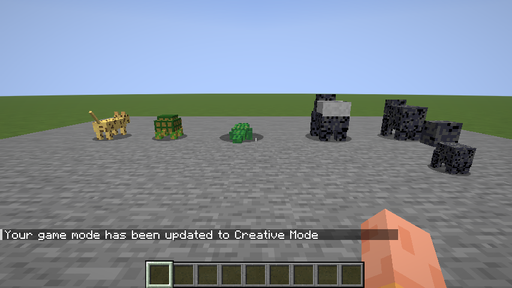

# Menagerie

A wildlife mod for Fabric (Minecraft 26.2) in the spirit of Untamed Wilds and Alex's
Mobs: a flagship gorilla with real troop life, plus a supporting roster, all built on a
**data-driven species registry** — adding a new species of an existing animal is one
JSON file, zero Java.

## Roster (Phase 1, v0.1.0)

- **Gorilla** — jungle troops of 3–6 with exactly one **silverback** (bigger, +50%
  attack, silver saddle). Neutral until you hurt any troop member — then the whole
  troop retaliates. The silverback chest-beats on a 30–90s cadence and when hostile
  mobs close in (slows nearby monsters, never players). Tame with **melon slices**
  (1-in-3 per feed) into a wolf-style companion: sit, follow, teleports past 32
  blocks, defends you. Babies ride on adults' backs until grown. Idle adults
  occasionally tear a leaves block (needs `mobGriefing`). Species: `lowland`
  (jungle), `mountain` (windswept hills + grove, thicker coat, +4 health).
- **Crocodile** — swamp ambush predator: floats in water, lunges at prey in reach,
  drags it (slowness + damage over 2s), releases. Neutral on land. Species: `nile`
  (swamp), `saltwater` (mangrove, 20% bigger, harder-hitting).
- **Tortoise** — savanna/badlands, fully passive, `worldgen_only`: spawns only with
  newly generated chunks, never respawns, drops nothing — killing them permanently
  empties the area. When hit it tucks into its shell: +8 armor, immobile, 10s.
  Breeds with sweet berries.
- **Leopard** — jungle stalker: crouch-approaches chickens, rabbits and baby animals,
  pounces with a leap; only attacks players already below half health; backs off when
  two or more players are close. Species: `leopard` (jungle), `snow` (grove/peaks,
  white coat, +4 health).

## The species system

Every tunable lives in `data/menagerie/species/*.json`: biomes (tags preferred),
spawn weight, group size, `worldgen_only`, health/attack/speed/scale, tame & breed
items, texture, and a per-animal `special` block (chest-beat cadence, grab length,
shell armor…). Species are hot-reloaded (`/reload`) and datapack-extensible.

Debug commands (`/menagerie census|troops|silverback`) print species/troop state —
built for the headless test battery in `VERIFY.md`.

## Known limitations

- Spawn **weights** are baked into biomes at world load: `/reload` can lower a
  species' effective natural-spawn rate (weight 0 = stop respawns) but raising a
  weight needs a server restart. Everything else (stats, items, special knobs) is
  fully live.
- No spawn eggs yet; use `/summon` (plain summon picks the biome-correct species).
- No loot tables yet — the roster drops nothing by design in Phase 1.
- `/summon` with extra NBT skips species finalization (vanilla behavior); plain
  `/summon` does the right thing.

## Art & sound

Vanilla-derived by doctrine: every texture is painted by `tools/gen-textures.js` onto
our own cube-model UV layouts using palettes **sampled from vanilla mob textures**
(wolf/panda grays, turtle greens, ocelot golds, polar bear whites) — no pixels copied
from other mods. All sounds are pitch-shifted references to vanilla sound events via
`sounds.json`; no external audio. License research for the referenced mods is in
`RESEARCH.md` (Alex's Mobs and Untamed Wilds were studied as *patterns only*).

## Building

JDK 25. `./gradlew build` → `build/libs/menagerie-0.1.0.jar`. Dev client:
`./gradlew runClient`. Render regression test: `./gradlew runGametest` (screenshots in
`build/run-gametest/screenshots/`).

## Changelog

### 0.1.0 (2026-08-15)
- Initial release: gorilla (troops/silverback/chest-beat/taming/babies), crocodile
  (ambush + grab), tortoise (shell, worldgen-only), leopard (stalker/opportunist).
- Data-driven species registry, 7 species across 4 animals, biome-tag spawn routing
  through Fabric BiomeModifications.
- Vanilla-style cube models with programmatic animation (knuckle-walk, chest-beat,
  lunge, shell-retract, crouch + pounce); generated vanilla-palette textures.
